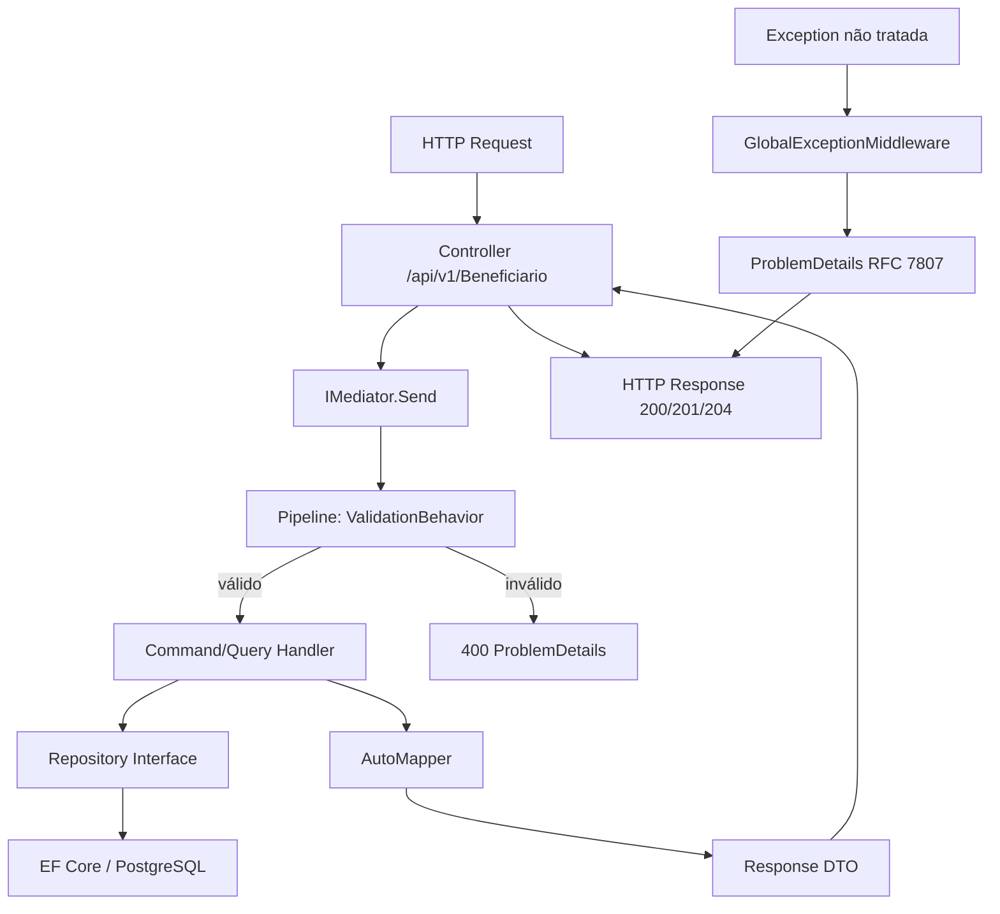

# Backend CQRS Migration — Design

**Spec:** `.specs/features/backend-cqrs-migration/spec.md`
**Status:** Draft

---

## Architecture Overview

**Antes (atual):**
```
Controller → Service (validação manual + lógica) → Repository → EF Core → PostgreSQL
```

**Depois (CQRS + MediatR):**
```
Controller → IMediator.Send(Command/Query)
                ↓
         [ValidationBehavior] → FluentValidation (automático)
                ↓
         [Handler] → Repository → EF Core → PostgreSQL
                ↓
         AutoMapper (Entity ↔ DTO)
```

A camada **Domain** (entidades, enums, interfaces de repositório) **não muda**. 
A camada **Infrastructure** (DbContext, Repositories, Configurations) **não muda**.
A camada **Application** ganha Commands, Queries, Handlers, Validators (substitui Services).
A camada **WebAPI** ganha middleware de exceção, versionamento, health checks.



---

## Code Reuse Analysis

### O que PERMANECE (não mexer)

| Componente | Localização | Por quê |
|-----------|-------------|---------|
| Entidades (Beneficiario, Plano, BaseEntity) | `Domain/Entities/` | Domínio não muda |
| Enums (StatusBeneficiario) | `Domain/Enums/` | Domínio não muda |
| Interfaces de repositório (IBeneficiarioRepository, IPlanoRepository) | `Domain/Interfaces/` | Mesmo contrato |
| Repositórios (BeneficiarioRepository, PlanoRepository) | `Infrastructure/Repositories/` | Implementação mantida |
| EF Configurations (BeneficiarioConfiguration, PlanoConfiguration) | `Infrastructure/Configurations/` | Schema mantido |
| AppDbContext | `Infrastructure/Data/` | Conexão e DbSets mantidos |
| Migrations | `Infrastructure/Migrations/` | Histórico do banco mantido |
| DTOs de request/response | `Application/DTOs/` | Reaproveitados como contrato dos Commands/Queries |

### O que MUDA (refatorar/substituir)

| Antigo | Novo | Motivo |
|--------|------|--------|
| `Application/Services/BeneficiarioService.cs` | `Application/Commands/Beneficiario/` + `Application/Queries/Beneficiario/` | Separação CQRS |
| `Application/Services/PlanoService.cs` | `Application/Commands/Plano/` + `Application/Queries/Plano/` | Separação CQRS |
| `Application/Services/Interfaces/IBeneficiarioService.cs` | ❌ Removido | MediatR dispensa interface de serviço |
| `Application/Services/Interfaces/IPlanoService.cs` | ❌ Removido | MediatR dispensa interface de serviço |
| Validação manual nos services | `Application/Validators/` (FluentValidation) | Validação declarativa |
| Mapeamento manual Entity↔DTO | `Application/Mappings/` (AutoMapper Profiles) | Mapeamento automático |
| try-catch nos controllers | `WebAPI/Middleware/GlobalExceptionMiddleware.cs` | Tratamento centralizado |
| `ErrorResponse.cs` (classe manual) | `ProblemDetails` (RFC 7807) | Padrão da indústria |

---

## Estrutura de Pastas (Application Layer)

```
src/Api.Beneficiarios.Application/
├── Commands/
│   ├── Beneficiario/
│   │   ├── CriarBeneficiarioCommand.cs
│   │   ├── CriarBeneficiarioCommandHandler.cs
│   │   ├── AtualizarBeneficiarioCommand.cs
│   │   ├── AtualizarBeneficiarioCommandHandler.cs
│   │   ├── ExcluirBeneficiarioCommand.cs
│   │   └── ExcluirBeneficiarioCommandHandler.cs
│   └── Plano/
│       ├── CriarPlanoCommand.cs
│       ├── CriarPlanoCommandHandler.cs
│       ├── AtualizarPlanoCommand.cs
│       ├── AtualizarPlanoCommandHandler.cs
│       ├── ExcluirPlanoCommand.cs
│       └── ExcluirPlanoCommandHandler.cs
├── Queries/
│   ├── Beneficiario/
│   │   ├── ObterBeneficiariosQuery.cs
│   │   ├── ObterBeneficiariosQueryHandler.cs
│   │   ├── ObterBeneficiarioPorIdQuery.cs
│   │   └── ObterBeneficiarioPorIdQueryHandler.cs
│   └── Plano/
│       ├── ObterPlanosQuery.cs
│       ├── ObterPlanosQueryHandler.cs
│       ├── ObterPlanoPorIdQuery.cs
│       └── ObterPlanoPorIdQueryHandler.cs
├── Validators/
│   ├── Beneficiario/
│   │   ├── CriarBeneficiarioValidator.cs
│   │   ├── AtualizarBeneficiarioValidator.cs
│   │   └── ExcluirBeneficiarioValidator.cs
│   └── Plano/
│       ├── CriarPlanoValidator.cs
│       └── AtualizarPlanoValidator.cs
├── Mappings/
│   ├── BeneficiarioProfile.cs
│   └── PlanoProfile.cs
├── Behaviors/
│   └── ValidationBehavior.cs
├── DTOs/          (mantido como está)
└── Services/      (remover Services/, manter Interfaces/ temporariamente até migrar)
```

---

## Pacotes NuGet a Adicionar

| Pacote | Versão | Propósito |
|--------|--------|-----------|
| `MediatR` | 12.x | Core do MediatR (Contracts + DI) |
| `FluentValidation` | 11.x | Validação declarativa |
| `FluentValidation.DependencyInjectionExtensions` | 11.x | Integração com DI do .NET |
| `AutoMapper` | 13.x | Mapeamento Entity ↔ DTO |
| `Serilog.AspNetCore` | 8.x | Logging estruturado |
| `Asp.Versioning.Mvc` | 8.x | Versionamento de API por URL |
| `AspNetCore.HealthChecks.NpgSql` | 7.x | Health check do PostgreSQL |

---

## Componentes

### ValidationBehavior (Pipeline do MediatR)

- **Purpose:** Intercepta todo Command/Query ANTES do handler e executa validação FluentValidation automaticamente
- **Location:** `src/Api.Beneficiarios.Application/Behaviors/ValidationBehavior.cs`
- **Interfaces:** `IPipelineBehavior<TRequest, TResponse>`
- **Dependencies:** `IEnumerable<IValidator<TRequest>>` (injetado pelo DI)
- **Reuses:** Nada — comportamento novo

### GlobalExceptionMiddleware

- **Purpose:** Captura TODAS as exceções não tratadas e retorna ProblemDetails (RFC 7807) — elimina try-catch dos controllers
- **Location:** `src/Api.Beneficiarios.WebAPI/Middleware/GlobalExceptionMiddleware.cs`
- **Interfaces:** Middleware ASP.NET Core (`InvokeAsync(HttpContext, RequestDelegate)`)
- **Dependencies:** `IWebHostEnvironment` (para decidir se mostra stack trace)
- **Mapeamento de exceções:**
  - `NotFoundException` → 404
  - `ValidationException` (FluentValidation) → 400
  - `BusinessRuleException` (conflito: CPF duplicado, plano com dependentes) → 409
  - Qualquer outra → 500

---

## Exceções de Domínio (novas)

Criar no `Domain/Exceptions/`:

```csharp
// Domain/Exceptions/NotFoundException.cs
public class NotFoundException : Exception
{
    public NotFoundException(string entityName, object key)
        : base($"'{entityName}' com id '{key}' não foi encontrado.") { }
}

// Domain/Exceptions/BusinessRuleException.cs  
public class BusinessRuleException : Exception
{
    public BusinessRuleException(string message) : base(message) { }
}
```

---

## Modelo de Paginação

```csharp
// Application/DTOs/Common/PaginatedResponse.cs
public class PaginatedResponse<T>
{
    public List<T> Items { get; set; } = [];
    public int Page { get; set; }
    public int PageSize { get; set; }
    public int TotalCount { get; set; }
    public int TotalPages => (int)Math.Ceiling(TotalCount / (double)PageSize);
    public bool HasNextPage => Page < TotalPages;
    public bool HasPreviousPage => Page > 1;
}
```

**Query params:** `?page=1&pageSize=10` (default: page=1, pageSize=10, max pageSize=100)

---

## Error Handling Strategy

| Erro | Origem | HTTP Status | Formato Resposta |
|------|--------|-------------|-----------------|
| Validação de entrada (CPF inválido, nome curto) | FluentValidation → ValidationBehavior | 400 | ProblemDetails + lista de erros |
| Recurso não encontrado (GET/PUT/DELETE com id inexistente) | Handler lança NotFoundException | 404 | ProblemDetails |
| CPF duplicado | Handler lança BusinessRuleException | 409 | ProblemDetails |
| Exclusão de plano com beneficiários | Handler lança BusinessRuleException | 409 | ProblemDetails |
| Erro interno inesperado | Exception não tratada | 500 | ProblemDetails (sem stack trace em produção) |

---

## Tech Decisions

| Decisão | Escolha | Motivo |
|---------|---------|--------|
| CQRS com classes separadas vs records | **Records** | Imutáveis por natureza, sintaxe concisa, ideal para Commands/Queries |
| MediatR 12 vs biblioteca alternativa | **MediatR 12** | Padrão de mercado .NET, documentação vasta |
| AutoMapper vs Mapster | **AutoMapper** | Mais difundido, maior base de exemplos pra aprendizado |
| FluentValidation vs Data Annotations | **FluentValidation** | Testável isoladamente, regras complexas, mensagens em português |
| ProblemDetails vs Result Pattern (OneOf/Flunt) | **ProblemDetails + exceções** | Mais simples para começar, nativo do ASP.NET Core |
| Paginação manual vs biblioteca | **Manual** | Simples o suficiente para implementar sem lib extra |
| Serilog vs NLog | **Serilog** | Melhor integração com ASP.NET Core, sinks mais modernos |
| Versionamento URL vs Header | **URL (/api/v1/)** | Mais visível, fácil de testar com Swagger/curl |
